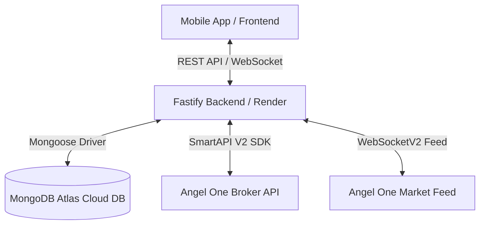
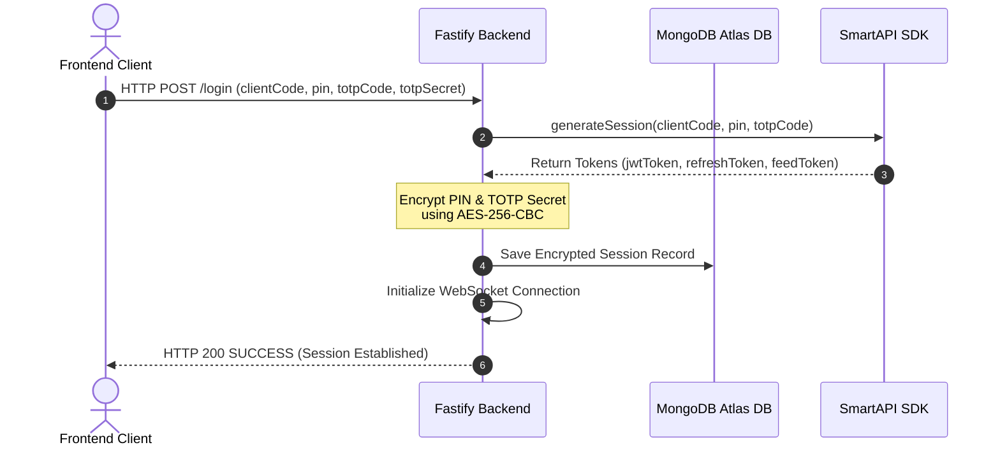
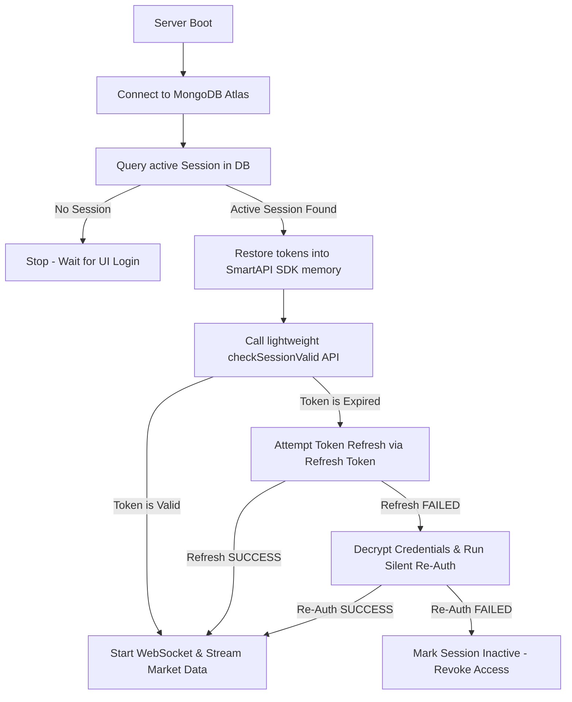
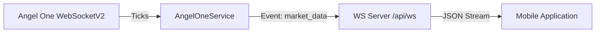

# AlgoTrade Pro - Backend Architecture & Session Persistence Engine

This document provides an in-depth explanation of the **AlgoTrade Pro Backend**, its core services, database persistence patterns, real-time streaming infrastructure, and the high-resiliency session restoration lifecycle. 

The backend is built as a robust, production-grade TypeScript application running on **Fastify** and integrated with **Mongoose (MongoDB Atlas)**, hosted as a containerized web service on **Render**.

---

## 1. System Overview & Deployment Architecture

### A. Hosting Environment (Render)
- **Service Type**: Render Web Service.
- **Spin-Down Prevention**: Uses a built-in self-pinging background routine (`server.ts`) triggering every 10 minutes to prevent the container from sleeping on free hosting tiers.
- **Port Binding**: Automatically binds to `process.env.PORT` to satisfy Render's HTTP routing requirements.

### B. Database Layer (MongoDB Atlas)
- **Persistency Model**: Hosted on MongoDB Atlas. It serves as the single source of truth for stock breakout detections, strategy settings, and live login sessions.
- **Connection Resiliency**: Integrated via Mongoose in [db.ts](file:///d:/Projects/algo-trade-pro/backend/src/config/db.ts) with dynamic catch-blocks that allow the server to remain online even during temporary database dropouts.

---

## 2. Core Modules & Data Models

The backend code is highly modular, split between API routes, background scan managers, and service orchestrators.

### A. MongoDB Database Models
1. **`AngelOneSession`** (`models/AngelOneSession.ts`): Holds active credentials and tokens.
2. **`Breakout`** (`models/Breakout.ts`): Stores identified breakout stocks with confidence scores, entry targets, and stop-loss targets.
3. **`PaperTrade`** (`models/PaperTrade.ts`): Tracks simulated and automated trades executed by the system.
4. **`Setting`** (`models/Setting.ts`): Simple key-value storage for parameters like starting capital.

---

## 3. Persistent Authentication & Security Architecture

To prevent users from being logged out during Render restarts, redeploys, or regular token expirations, the backend implements an advanced session persistence engine.

### A. Secure Encryption at Rest
To safely automate re-authentication past token expiry (e.g., after daily midnight resets), the backend encrypts sensitive user credentials.
- **Helper**: `utils/crypto.ts`
- **Algorithm**: `AES-256-CBC`
- **Keys**: Incorporates a 32-byte `SESSION_ENCRYPTION_KEY` environment variable.
- **Format**: Encrypted payloads are saved in MongoDB in an `iv:ciphertext` format, preventing potential data leaks.

### B. Startup Recovery Flow
When the container starts up or redeploys, it executes the following automatic restoration pipeline:

---

## 4. WebSockets & Tick Heartbeat Monitor

Live prices and ticks are broadcast to the mobile application via a Fastify WebSocket server (`/api/ws`).

### A. The Silent Drop-Out Problem
WebSockets on cloud containers are prone to silent disconnects or termination due to inactivity. Furthermore, if a WebSocket drops and the underlying JWT access token has expired, simple reconnection loops will fail indefinitely.

### B. The Resiliency Heartbeat Engine
The backend introduces a background **Heartbeat Monitor** to handle WebSockets:
1. **Tick Logging**: Every incoming tick updates `lastTickTime = Date.now()`.
2. **Heartbeat Watcher**: A check runs every 30 seconds:
   - If **more than 45 seconds** have elapsed without a tick during active trading sessions:
     - The service initiates a session validity check.
     - If the session is unauthorized, it triggers the `ensureAuthenticated()` recovery flow (refreshing tokens or silently logging in again).
     - Once authenticated, it tears down the stale socket and spawns a fresh `WebSocketV2` instance.
3. **Reconnection Limits**: Implements exponential backoff (`reconnectAttempts`) up to 5 attempts before forcing full re-authentication, preventing CPU-hogging reconnect loops.

---

## 5. Background Strategy Engine & Scan Cron Jobs

### A. Weekly Breakout Scanner (`cron/scanner.ts`)
- Scheduled via `node-cron` to trigger weekly.
- Automatically handles API logins utilizing the silent re-authentication helper.
- Downloads historical candles via `getHistoricalData()`, pipes the candles to `analysisService.ts` to identify statistical breakouts, and commits them to MongoDB Atlas for mobile retrieval.

### B. Strategy Order Executor (`services/strategy/orderExecutor.ts`)
- Subscribes to live `market_data` events broadcast by `AngelOneService`.
- Parses live SnapQuotes (Nifty and BankNifty LTP) to check entry parameters, manage risk metrics, and simulate order executions in real time.

---

## 6. Backend API Route Map

All REST endpoints are configured with Fastify and served on the `/api` prefix:

| Endpoint | Method | Description |
| :--- | :--- | :--- |
| `/api/auth/login` | `POST` | Establishes the initial session and stores credentials securely. |
| `/api/auth/status` | `GET` | Returns the dynamic state of `isAuthenticated` for the frontend. |
| `/api/auth/logout` | `POST` | Thoroughly purges sessions from database and memory. |
| `/api/breakout` | `GET` | Fetches the latest 50 breakout signals from MongoDB Atlas. |
| `/api/options` | `GET` | Generates options data (strikes, confidence) based on live LTP. |
| `/api/trades` | `GET` / `POST` | Controls and tracks running simulation trades. |
